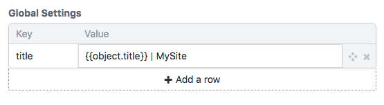

# MegaMerge plugin for Craft CMS 3.x

MegaMerge: [merge]()
MegaMerge provides a fieldtype which is a Craft table with predefined `Key` and `Value` columns. It lets you merge together those fields with php arrays and twig arrays, and then look up values of keys in the merged array. The resultant values are parsed as twig.

This is a general purpose utility, though one of its potential uses (and the one for which I wrote it) is as a do-it-yourself seo system.

## Requirements

This plugin requires Craft CMS 3.0.0 or later.

## Installation

1. Install with Composer via `composer require marionnewlevant/mega-merge` from your project directory
2. Install plugin in the Craft Control Panel under Settings > Plugins

or

1. Install via the Plugin Store

## MegaMerge Overview

MegaMerge provides a fieldtype (a key/value table) and three functions:

`craft.megaMerge.init()` is passed an array of key/value pairs (elements in this array can be megaMerge fields, php arrays, or twig arrays), and a context object. It adds the key/value pairs to a global collection of key/value pairs, and the context object to a global context object.

`craft.megaMerge.reset()` sets the global key/value pairs and the global context to empty.

`craft.megaMerge.value(key)` looks up the value associated with key in the key/value pairs, interprets it as twig using the global context, and retuns the parsed value. It returns `null` if there is no matching value.

## Using MegaMerge

**The key/value pairs** A megaMerge field called `globalSettings` in the `g_configuration` global set: 



Settings defined in config/general.php:

```php
'megaMerge' => [
    'title' => 'MySite page',
],
```

**Calling `init`** The `globalSettings` values will override the `config.general.megaMerge` ones:

```twig

```

**Calling `value`**

```twig
<title>{{ craft.megaMerge.value('title') }}</title>
```


Brought to you by [Marion Newlevant](http://marion.newlevant.com).
Icon insides by [Dmitry Baranovskiy from the Noun Project](https://thenounproject.com/term/merge/5026/)
